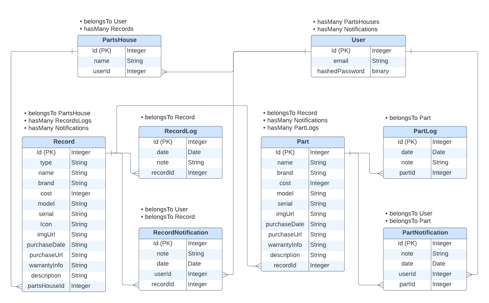

# PartsHouse
Partshouse is a REST API AND MERN stack web application using REACT.js and Redux Toolkit.
It is designed to keep track of valuable assets in your home and allows you to schedule notifications to re-purchase items with a previously saved link. Partshouse is the place to keep information regarding home appliances, pc components, car parts etc...  so you're no longer shuffeling through that miscellanious drawer we all know you have.

## Current Schema

## Start
To run backend and frontend concurrently:
npm run dev

## MVP Checklist
<pre>
- [ x ] Add Additional Advanced info for Records and Parts
    - [ x ] Add advanced data in Model
    - [ x ] Add some data
    - [ x ] Add icons

- [ x ] Create Button to Add a Record
    - [ x ] Button Open Modal
    - [ x ] Can selected which partshouse it is assicated with.
    - [ x ] Location: Above Accordions

- [ x ] Style the Accordion Button
    - [ x ] icon, left of button
    - [ x ] data, inside AccordionItem when opened

- [ x ] Add Items to Dashboard Accordion
    - [ x ] "More Info" Button, 
    - [ x ] "Add Part" Button, 

- [ ] Style a Parts Card component for each Part 
    - [ ] Name, 
    - [ ] Repurchase Button, or
    - [ ] Add Repurchase Link (modal just to add link)

- [  ] Create Modal to Add a Part
    - [  ] Button Open Modal
    - [  ] Can selected which partshouse it is assicated with.
    - [  ] Location: Above Accordions

- [ ] Create Record Page
    - [ ] Part Cards
    - [ ] Logs Section
    - [ ] Create Button to Edit a Record

</pre>
